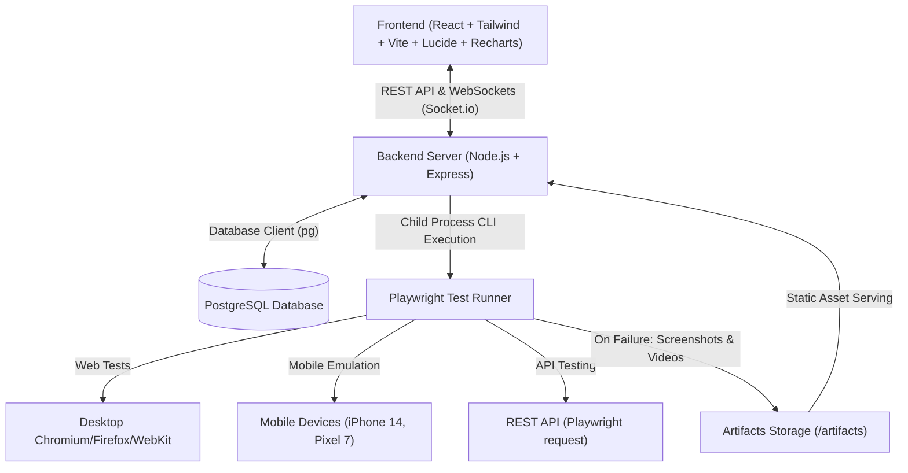

# QA Automation Dashboard - Implementation Plan

An all-in-one QA Dashboard system for automated test execution, live monitoring, metrics reporting, and artifact management using React, Tailwind CSS, Node.js, PostgreSQL, and Playwright.

---

## 1. System Architecture & Components



### Component Details

1. **Frontend (`/frontend`)**:
   - **Framework**: React 18 / 19 with Vite, Tailwind CSS, Lucide-React icons, Recharts for analytics.
   - **Dashboard Overview**: Summary cards (Total Runs, Pass Rate %, Failures, Avg Duration), Pass/Fail trend charts, and test distribution.
   - **Test Suite Catalog**: Table of available test suites (Web E2E, Mobile Emulation, API Test Suites) with quick-launch triggers, tags, and last execution status.
   - **Live Execution Console**: Real-time progress bar, running phase, terminal-like live streaming logs (via Socket.io), and cancel/stop button.
   - **Run History & Detail View**: Paginated history table, filterable by status and type. Drill-down view showing detailed test cases, execution duration, error traces, and embedded failure screenshots & video players.

2. **Backend (`/backend`)**:
   - **Runtime**: Node.js with Express & Socket.io.
   - **Test Runner Service**: Executes Playwright CLI (`npx playwright test ...`) dynamically with targeted project/suite filters, streams `stdout`/`stderr` line-by-line in real time to connected WebSocket clients, and stores run records.
   - **JSON Reporter Parser & Attachment Collector**: Parses Playwright JSON test results to extract failed test screenshots (`.png`) and videos (`.webm`), saving metadata to the database.
   - **API Endpoints**:
     - `GET /api/suites`: Available test suites and definitions.
     - `POST /api/tests/run`: Launch execution for a suite, multi-suite, or custom options.
     - `POST /api/tests/stop/:runId`: Abort an active test process.
     - `GET /api/runs`: Fetch paginated execution history with metrics.
     - `GET /api/runs/:id`: Get detailed test run, including individual test cases and artifacts.
     - `GET /api/stats`: Pass/fail rates, durations, and trend data for dashboard charts.
     - `GET /artifacts/*`: Static file server for failure screenshots and video recordings.

3. **Database (`/backend/src/db`)**:
   - **Engine**: PostgreSQL using `pg` (node-postgres) connection pool.
   - **Auto-Provisioning**: Automated table creation on startup (`initDb()`), with docker-compose service definition provided.
   - **Fallback Mechanism**: SQLite / embedded database fallback if PostgreSQL is temporarily unreachable, ensuring seamless testing and development out of the box.
   - **Schema**:
     - `test_runs`: Tracks run ID, suite ID, suite name, category (`e2e`, `mobile`, `api`), status (`running`, `passed`, `failed`, `cancelled`), started_at, finished_at, duration_ms, pass_count, fail_count, total_count.
     - `test_cases`: Test item title, status, duration, error message, stack trace, screenshot URL, video URL.
     - `test_logs`: Run ID, log stream (`stdout`, `stderr`, `system`), timestamp, message.

4. **Playwright Automation Engine (`/tests` & `playwright.config.ts`)**:
   - **Mobile Emulation**: Configured with `devices['iPhone 14 Pro']` and `devices['Pixel 7']` with mobile viewports, touch emulation, and mobile user agents.
   - **API Testing**: Uses Playwright's built-in `request` fixture to test REST APIs (GET, POST, PUT, DELETE, headers, and response schema).
   - **Failure-Only Artifacts**: Configured with `screenshot: 'only-on-failure'` and `video: 'retain-on-failure'` to conserve disk space while capturing actionable debugging evidence.

---

## 2. Directory Structure

```
Test_auto/
├── docker-compose.yml              # PostgreSQL container service definition
├── package.json                    # Root workspace manager & scripts
├── playwright.config.ts            # Playwright configuration (failure-only media, projects)
├── tests/
│   ├── e2e/
│   │   ├── web-app.spec.ts         # Desktop Web E2E tests
│   │   └── failing-demo.spec.ts    # Intentional failure test to showcase screenshot/video capture
│   ├── mobile/
│   │   └── mobile-web.spec.ts      # Mobile emulation tests (Pixel / iPhone)
│   └── api/
│       └── api-integration.spec.ts # Playwright request fixture API tests
├── backend/
│   ├── package.json
│   ├── .env.example
│   └── src/
│       ├── server.js               # Express & Socket.io server entry
│       ├── config.js               # Environment & app configuration
│       ├── db/
│       │   ├── index.js            # DB connection & pool manager
│       │   └── schema.sql          # PostgreSQL table schemas
│       ├── services/
│       │   ├── testRunner.js       # Playwright child process execution & log streamer
│       │   └── testParser.js       # JSON test report & artifact mapper
│       └── routes/
│           ├── suites.js           # Test suite listing
│           ├── runs.js             # Test run history & details
│           └── stats.js            # Analytics & metrics
└── frontend/
    ├── package.json
    ├── vite.config.js
    ├── tailwind.config.js
    ├── index.html
    └── src/
        ├── main.jsx
        ├── App.jsx
        ├── components/
        │   ├── Navbar.jsx          # Header & system status indicator
        │   ├── StatsOverview.jsx   # Metrics cards & trend charts
        │   ├── TestSuitesTable.jsx # Suite catalog with "Run" actions
        │   ├── LiveConsole.jsx     # Live progress bar & terminal log viewer
        │   ├── RunHistoryTable.jsx # Historical runs table
        │   └── RunDetailModal.jsx  # Run inspection with failure screenshot/video viewer
        └── services/
            ├── api.js              # REST API client
            └── socket.js           # Socket.io live log subscriber
```

---

## 3. Implementation Steps

1. **Root Setup & Playwright Configuration**:
   - Initialize root and install Playwright test dependencies.
   - Configure `playwright.config.ts` with projects for Desktop Web, Mobile Emulation (`Pixel 7`, `iPhone 14`), and API Testing.
   - Configure screenshot `only-on-failure` and video `retain-on-failure`.
   - Write standard test suites (`tests/e2e/web-app.spec.ts`, `tests/mobile/mobile-web.spec.ts`, `tests/api/api-integration.spec.ts`, and `tests/e2e/failing-demo.spec.ts`).

2. **Backend Implementation**:
   - Set up Express, CORS, Socket.io, `pg` (node-postgres), and `better-sqlite3` fallback.
   - Implement database connection pool with automatic table initialization on startup.
   - Create `testRunner.js` to execute Playwright with `child_process.spawn`, piping real-time stdout/stderr through Socket.io and parsing resulting JSON reports into database records.
   - Implement REST endpoints for suites, runs, stats, stop execution, and static artifact serving.

3. **Frontend Implementation**:
   - Scaffold Vite + React + Tailwind CSS frontend.
   - Create modern, sleek dark-mode UI with clean cards, status badges, and animated progress bars.
   - Implement Recharts visualizations for Pass vs Fail distribution and duration trends.
   - Build live streaming terminal console with auto-scroll, clear, and execution status.
   - Build test run details view with test step breakdown, error trace display, and embedded video/screenshot preview modal.

4. **Docker & Documentation**:
   - Provide `docker-compose.yml` for running PostgreSQL (and optionally full stack).
   - Write comprehensive README with setup instructions, database connection guidelines, and usage walkthrough.

---

## 4. Verification Plan

### Automated Verification
- Run Playwright CLI tests directly to verify:
  1. Desktop Web tests pass.
  2. Mobile Emulation tests pass.
  3. API tests pass.
  4. Intentional failure test produces screenshot (`.png`) and video (`.webm`) in the test-results directory.
- Verify Backend API endpoints with HTTP requests:
  - `GET /api/suites`
  - `POST /api/tests/run`
  - `GET /api/runs`
  - `GET /api/stats`

### UI & End-to-End Verification
- Start Backend and Frontend servers.
- Trigger test runs from the UI table ("Run E2E Web", "Run Mobile Web", "Run API Tests", "Run Failing Demo").
- Verify live progress bar moves and logs stream in real-time.
- Verify completion status, database record persistence, and artifact rendering (screenshot and video) on the run details modal.
