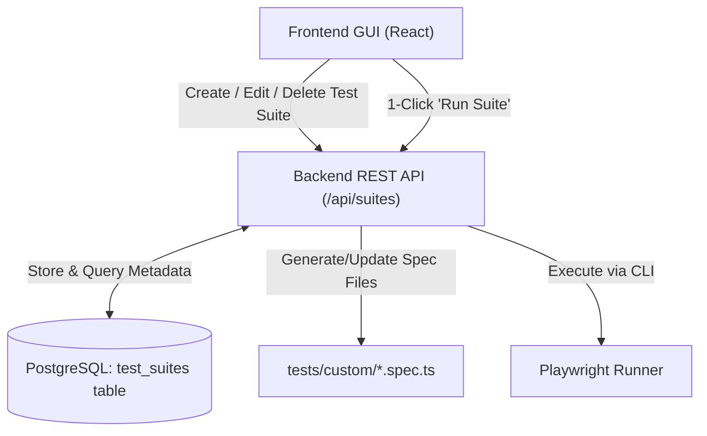

# Implementation Plan - Test Suite CRUD Management on GUI

Enable users to **Create, Read, Update, and Delete (CRUD)** Test Suites directly through the React Frontend GUI, saving configurations and test code to PostgreSQL and executing them with Playwright.

---

## 1. Architecture & Design

### Component Details

1. **Database Layer (`backend/src/db/schema.sql`)**:
   - New table: `test_suites`:
     - `id` (VARCHAR(64) PRIMARY KEY)
     - `name` (VARCHAR(255))
     - `type` (VARCHAR(32)) -- `e2e`, `mobile`, `api`
     - `description` (TEXT)
     - `project` (VARCHAR(64)) -- `chromium`, `mobile-chrome`, `mobile-safari`, `api`
     - `target_url` (VARCHAR(500))
     - `code` (TEXT) -- Playwright test code
     - `tags` (TEXT[]) -- Array of tags
     - `created_at`, `updated_at` (TIMESTAMPTZ)
   - Auto-seed default suites if table is empty.

2. **Backend API (`backend/src/routes/suites.js` & `backend/src/services/testRunner.js`)**:
   - `GET /api/suites`: Returns all suites from PostgreSQL.
   - `POST /api/suites`: Creates a new suite in DB and writes its code to `tests/custom/<id>.spec.ts`.
   - `PUT /api/suites/:id`: Updates suite metadata and updates the spec file on disk.
   - `DELETE /api/suites/:id`: Removes suite from DB and unlinks its file from `tests/custom/`.

3. **Frontend UI (`frontend/src/components/`)**:
   - **New "Create Suite" Button** on Test Suites Catalog header.
   - **`SuiteModal.jsx`**: Modal form supporting:
     - Suite Name & Description
     - Suite Type (Desktop Web, Mobile Emulation, API Request)
     - Target Device / Project selector (`chromium`, `mobile-chrome`, `mobile-safari`, `api`)
     - Target URL
     - Tags input (comma separated)
     - **Test Code Editor**: Pre-filled with smart starter templates based on selected type (Desktop E2E, Mobile Emulation, or API test template).
   - **Edit Action**: Edit icon on each table row allowing modifications to code or parameters.
   - **Delete Action**: Trash icon with confirmation dialog to safely remove suites.

---

## 2. Proposed File Changes

### [Backend]
- `backend/src/db/schema.sql`: Add `test_suites` table definition.
- `backend/src/services/testRunner.js`: Load suites dynamically from DB + disk sync.
- `backend/src/routes/suites.js`: Add `POST`, `PUT`, `DELETE` handlers.

### [Frontend]
- `frontend/src/services/api.js`: Add `createSuite`, `updateSuite`, `deleteSuite`.
- `frontend/src/components/SuiteModal.jsx`: [NEW] Create & Edit suite modal with test templates & code editor.
- `frontend/src/components/TestSuitesTable.jsx`: Add "Create Suite" button, "Edit" button, and "Delete" button.
- `frontend/src/App.jsx`: State management and CRUD handlers.

---

## 3. Verification Plan

### Automated & API Verification
- Test `POST /api/suites` to create a custom test suite.
- Test `GET /api/suites` to ensure the new suite is retrieved.
- Test `PUT /api/suites/:id` to modify test code and metadata.
- Trigger test run for the new custom suite and verify execution in Playwright.
- Test `DELETE /api/suites/:id` and ensure DB record and file are removed.

### UI Verification
- Open dashboard at `http://localhost:4000`.
- Click "Create Test Suite" -> Fill form with a new target URL -> Save.
- Verify suite appears in the table.
- Click "Run Suite" and verify real-time logs and pass/fail results.
- Click "Edit", change assertion, save, and re-run.
- Click "Delete" and verify removal.
